<div align="center">

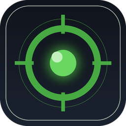

# SC BP Watcher

**Live-Overlay, das neue Star-Citizen-Baupläne anzeigt, sobald du sie freischaltest**

<sub>Windows · Linux · ohne Konto, ohne Cloud — mit Installer oder als einzelne Datei</sub>

[](../../releases)
[](LICENSE)
[](https://discord.gg/g2E7e6XxZC)
[](https://www.python.org/)
[](#voraussetzungen)
[](https://robertsspaceindustries.com/)

[English](README.md) · **Deutsch**

</div>

---

Ein kleines, randloses Overlay, das beim Spielen **in Echtzeit** meldet, sobald ein neuer Bauplan (Blueprint) dazukommt — inklusive Name, Art und Uhrzeit. Ohne Account, ohne Cloud. Läuft unter **Windows und Linux**.

> 💬 **Es gibt einen Discord.** Fragen, Hilfe bei Problemen, neue Fassungen und ein Forum für Fehler und Wünsche: **[discord.gg/g2E7e6XxZC](https://discord.gg/g2E7e6XxZC)**. Wer lieber hier bleibt, macht ein [Issue](../../issues) auf — beides wird gelesen.

> 🧪 **Testfassungen ausprobieren.** Vor jeder Veröffentlichung gibt es **Vorabversionen** (`-rc`) unter [Releases](../../releases) — dort steht bei jeder, was sie bringt und was sich seit der vorigen geändert hat. Sie werden **niemandem als Update angeboten**: Wer sie will, lädt sie dort herunter. Wer eine ausprobiert und etwas findet, macht bitte ein [Issue](../../issues) auf — genau dafür sind sie da.

> ℹ️ **Der SC Deutsch Launcher ist nicht mehr Voraussetzung.** Die eigentliche Quelle ist die `Game.log` von Star Citizen — dort steht jeder freigeschaltete Bauplan im Klartext. Ist der Launcher da, wird er weiter genutzt: Er bestätigt die Funde und liefert deutsche Bezeichnungen. Ist er nicht da (unter Linux immer), läuft der Watcher trotzdem.

<table>
<tr>
<td width="32%" valign="top" align="center">
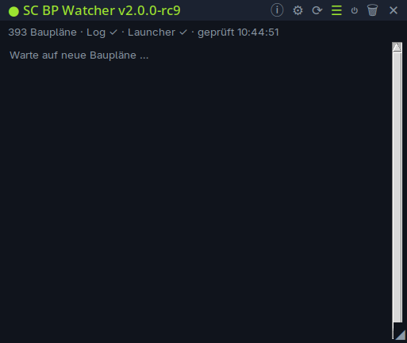<br>
<sub>Das Overlay — schmal, immer im Vordergrund, Durchsichtigkeit einstellbar</sub>
</td>
<td width="68%" valign="top" align="center">
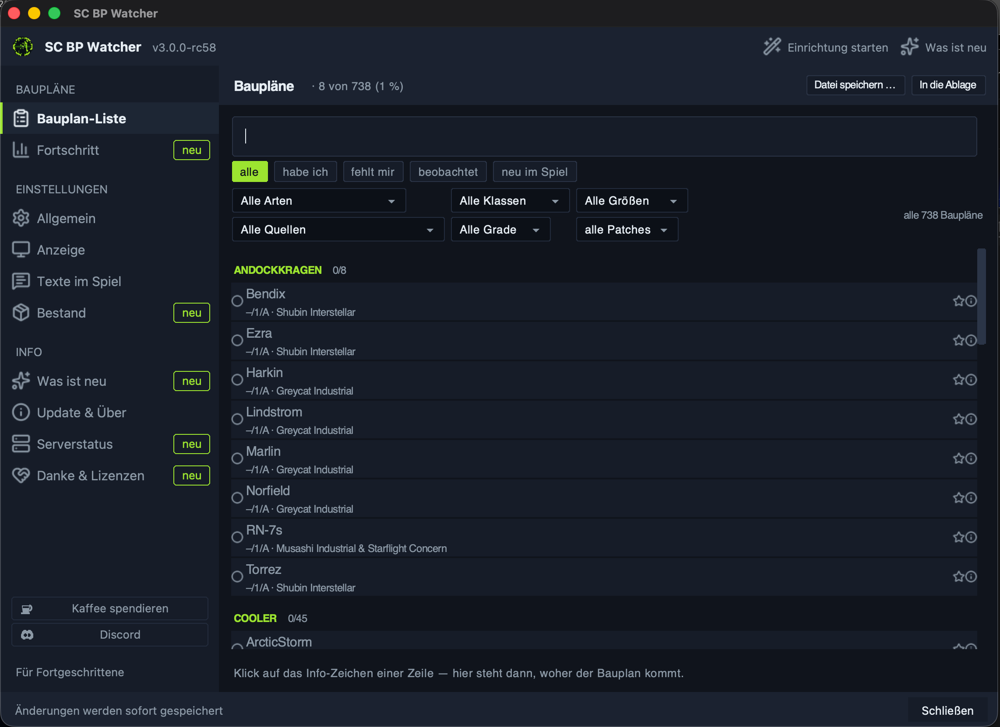<br>
<sub>Die Bauplan-Liste — Suche, fünf Filter und die Herkunft je Bauplan</sub>
</td>
</tr>
</table>

### Im Spiel, ohne herauszutabben

Der Watcher schreibt in die Auftragstexte des Spiels, **welche** Baupläne ein Auftrag ausschüttet — mit `[x]` für das, was du schon hast. Die Zählung steht schon im Titel, die Namen in der Beschreibung.

<table>
<tr>
<td width="50%" valign="top" align="center">
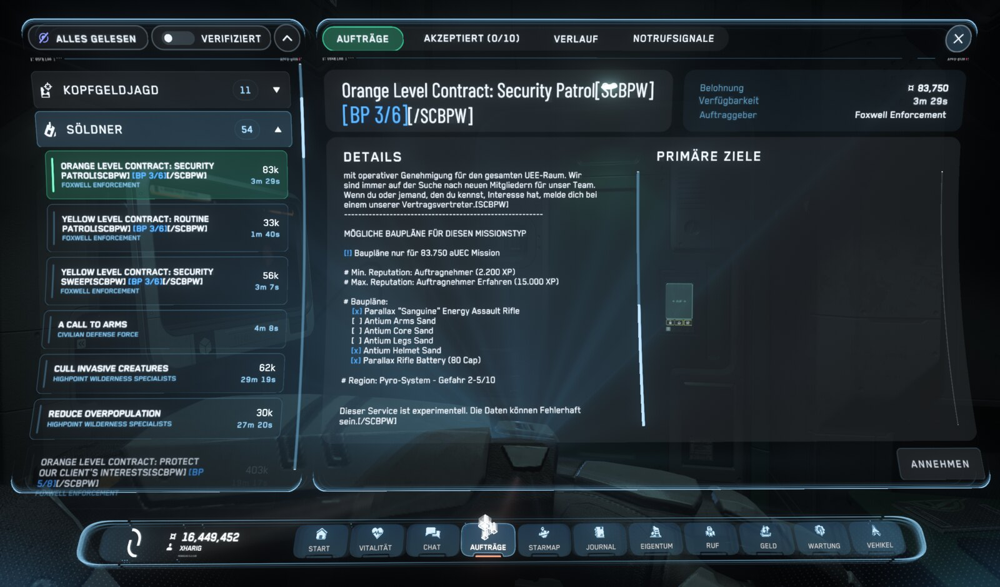<br>
<sub><b>3 von 6</b> — <code>[x]</code> hast du, <code>[&nbsp;&nbsp;]</code> fehlt noch</sub>
</td>
<td width="50%" valign="top" align="center">
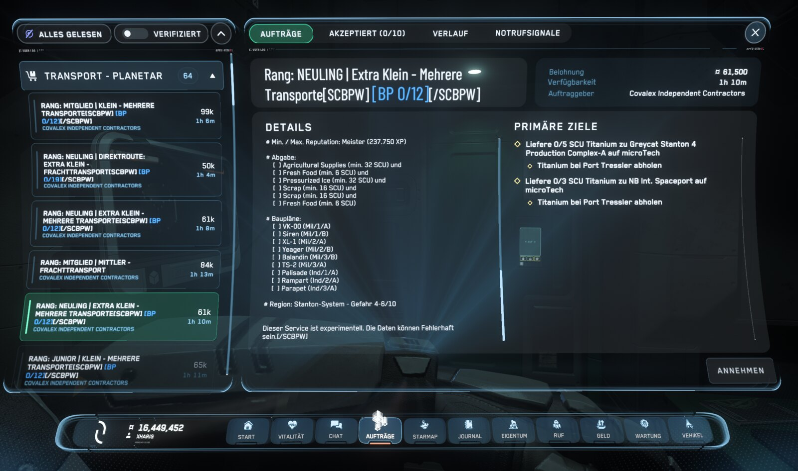<br>
<sub><b>0 von 12</b> — hier ist noch nichts dabei, was du hast</sub>
</td>
</tr>
</table>

### Das Fenster

> [!NOTE]
> Die folgenden Bilder zeigen **v3.0.0** (derzeit als Testfassung `v3.0.0-rc` unter [Releases](../../releases)). In v2.0.0 sieht das Fenster noch anders aus — wer dort etwas sucht, was hier zu sehen ist, findet es nicht. Das ist kein Fehler, sondern die ältere Fassung.

<table>
<tr>
<td width="50%" valign="top" align="center">
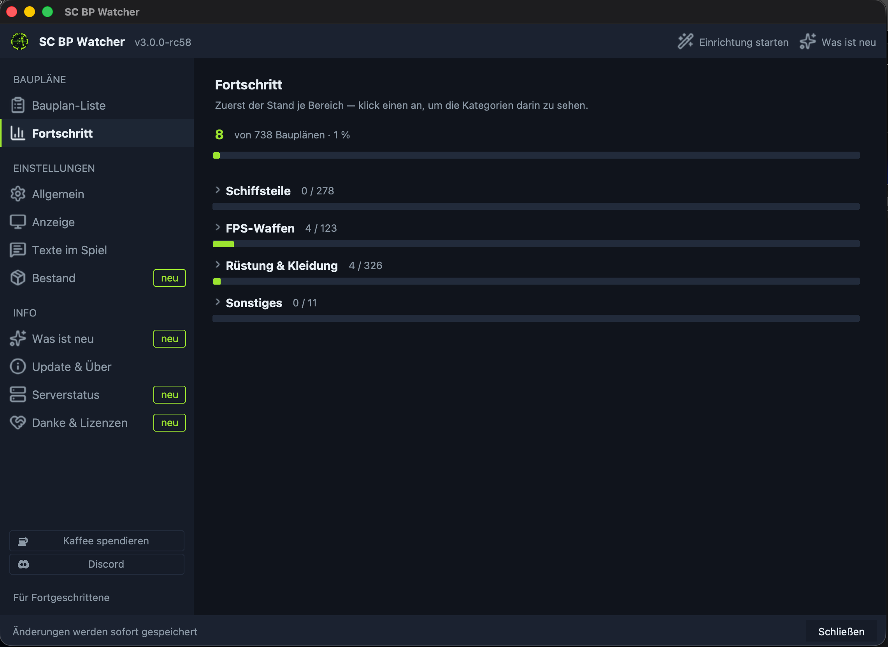<br>
<sub><b>Fortschritt</b> — je Bereich, Einzelheiten auf Klick</sub>
</td>
<td width="50%" valign="top" align="center">
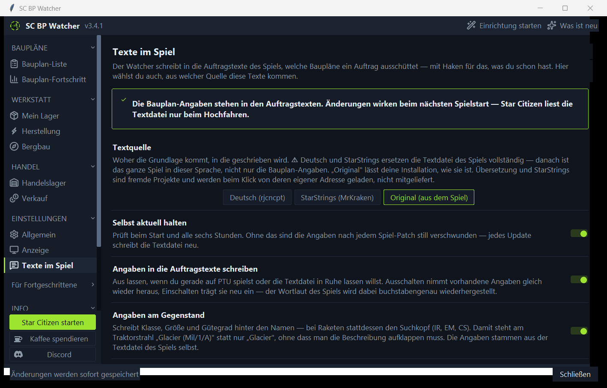<br>
<sub><b>Auftragstexte</b> — Textquelle wählen, ein- und ausschalten</sub>
</td>
</tr>
<tr>
<td valign="top" align="center">
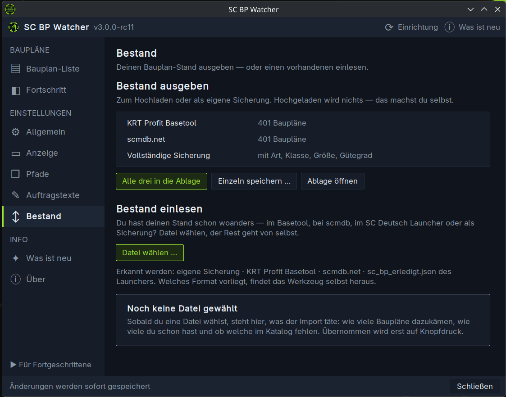<br>
<sub><b>Bestand</b> — ausgeben fürs Basetool, oder einen vorhandenen einlesen</sub>
</td>
<td valign="top" align="center">
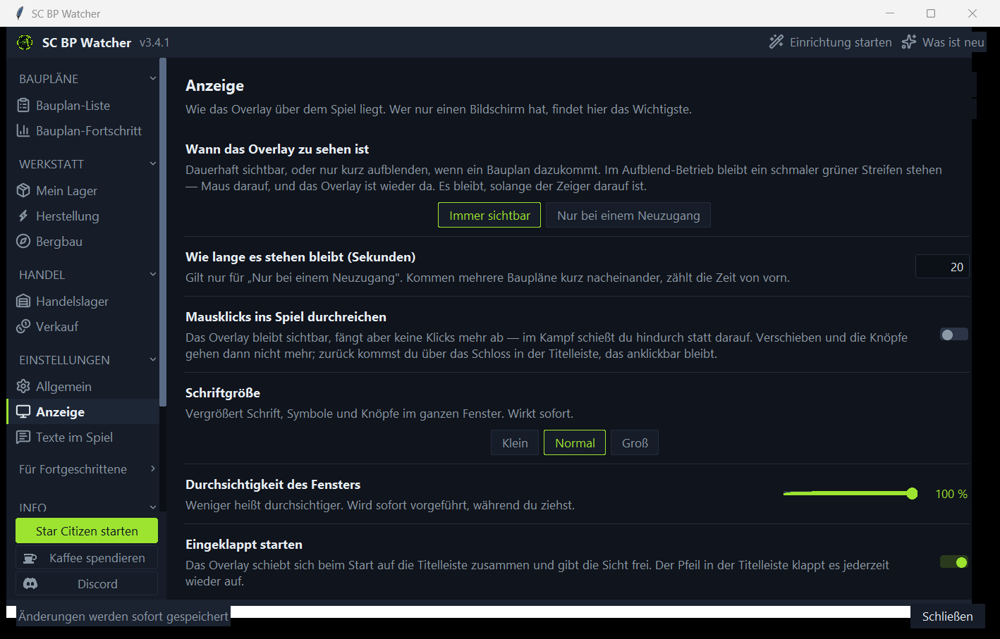<br>
<sub><b>Anzeige</b> — Aufblend-Betrieb, Klicks durchreichen, Schriftgröße</sub>
</td>
</tr>
<tr>
<td valign="top" align="center">
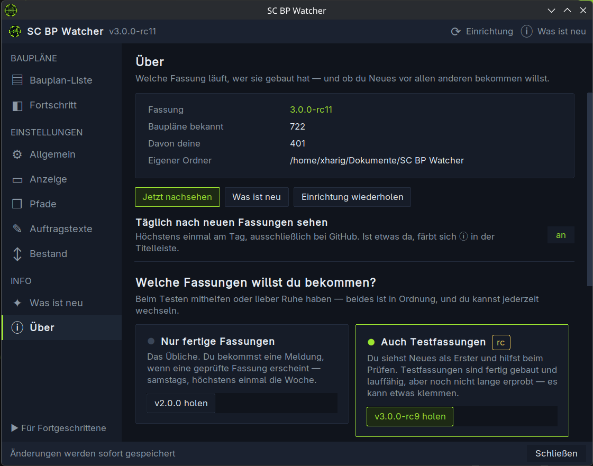<br>
<sub><b>Über</b> — fertige Fassungen oder Testfassungen, mit Knopf zum Holen</sub>
</td>
<td valign="top" align="center">
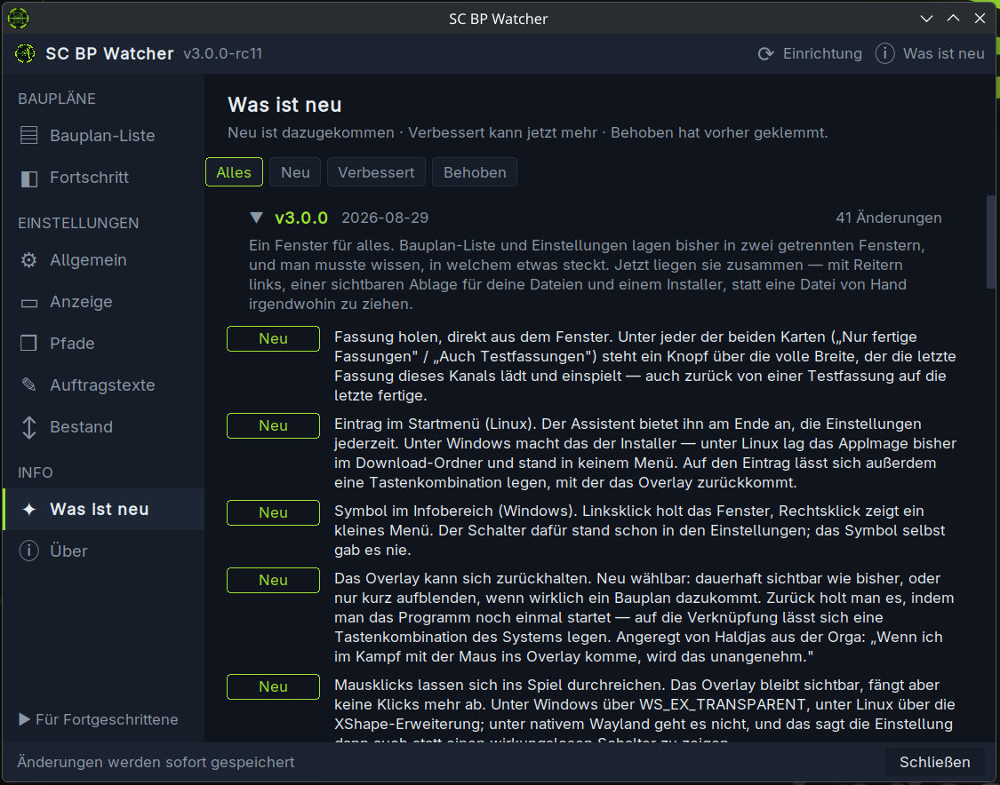<br>
<sub><b>Was ist neu</b> — jede Fassung aufklappbar, gefiltert nach Art</sub>
</td>
</tr>
</table>

<details>
<summary>Und der Rest: Allgemein und Pfade</summary>

<table>
<tr>
<td width="50%" valign="top" align="center">
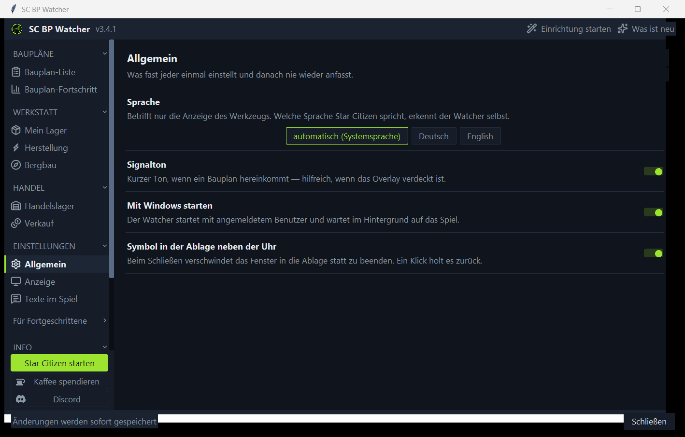<br>
<sub><b>Allgemein</b> — Sprache, Signalton, Autostart, Startmenü-Eintrag</sub>
</td>
<td width="50%" valign="top" align="center">
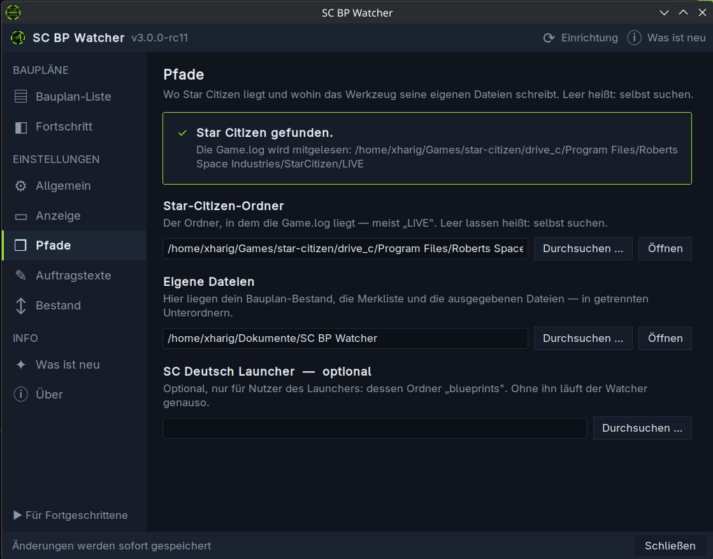<br>
<sub><b>Pfade</b> — wo Star Citizen liegt und wohin das Werkzeug schreibt</sub>
</td>
</tr>
</table>

</details>

## Warum dieses Tool

Bauplan-Listen gibt es mehrere. Vier Dinge machen den Unterschied im Alltag:

- **Du musst nicht aus dem Spiel.** Das Overlay liegt über Star Citizen. Kein zweites Fenster, kein Alt-Tab, kein Nachschlagen im Browser — der neue Bauplan steht einfach da, während du weiterspielst.
- **Es weiß, was du schon hast.** Der Watcher führt deinen Bauplan-Bestand selbst und liest beim ersten Start die aufgehobenen Spielprotokolle nach — du bekommst deinen bisherigen Stand geschenkt, ohne etwas einzutippen. Bleibt trotzdem eine Lücke, sagt er das, statt eine unvollständige Liste als vollständig auszugeben.
- **Es sagt dir, woher du das Fehlende bekommst.** Für **655 der 722** Baupläne steht dabei, welche Fraktion sie auslobt, in welchem Auftrag, ab welchem Rang und was er einbringt — sortiert nach dem leichtesten Weg. „Mir fehlt X" ist die halbe Information; die ganze ist „X gibt es bei Foxwell ab Veteran Contractor".
- **Es meldet auch, was du noch gar nicht haben kannst.** Die Katalog-Wache erkennt, wenn CIG mit einem Patch etwas **neu craftbar** macht — unabhängig von deinem eigenen Freischalt-Stand (🔵). Wer auf ein bestimmtes Teil wartet, trägt es in die Beobachtungsliste ein und wird beim Auftauchen auffällig darauf gestoßen (⭐).
- **Nichts verlässt deinen Rechner.** Kein Konto, keine Anmeldung, keine Cloud. Das Tool liest ausschließlich Dateien, die ohnehin auf deiner Platte liegen, und schreibt nichts zurück ins Spiel.

Dazu: Klasse, Größe und Gütegrad stehen direkt in der Zeile (`M/1/A`), die Oberfläche gibt es auf Deutsch und Englisch, und das Ganze läuft mit reiner Python-Standardbibliothek — keine Zusatzpakete, keine Abhängigkeiten, die morgen zerbrechen.

## Features

| | |
|---|---|
| ⚡ **Sofort-Meldung** | Liest die Star-Citizen-`Game.log` mit → der Bauplan steht **in Sekunden** in der Liste |
| 📋 **Bauplan-Liste** | Alle Baupläne durchsuchen, nach Art gruppiert, Filter *alle / habe ich / fehlt mir*, mit Fortschrittsanzeige. Häkchen per Klick |
| 🧭 **Herkunft je Bauplan** | Ein Klick zeigt Fraktion, Auftrag, nötigen Rang und Belohnung — für **655 von 722** Bauplänen, sortiert nach dem leichtesten Weg |
| 🧙 **Einrichtungsassistent** | Vier Schritte beim ersten Start — und **jederzeit wiederholbar**, ohne sich durch Menüs zu klicken |
| 🔵 **Katalog-Wache** | Meldet auch, wenn im **Spiel** etwas neu craftbar wird — also wenn CIG einen Bauplan nachreicht, den es vorher gar nicht gab (nicht nur, was du selbst freischaltest) |
| ⭐ **Merkliste** | Klick auf den Stern in der Liste — taucht der Bauplan auf, wird er auffällig gemeldet und **verschwindet danach von selbst** von der Merkliste |
| 🏷️ **Klasse · Size · Grade** | Kompakt-Kürzel `Klasse/Size/Grade` je Bauplan, z. B. `M/1/A` (Military · Size 1 · Grade A) |
| 🔔 **Signalton** | Kurzer Ton bei jedem Neuzugang — du musst nicht aufs Fenster schauen |
| 🧷 **Immer im Vordergrund** | Randloses, leicht durchscheinendes Overlay über dem Spiel |
| 🖱️ **Verschiebbar & skalierbar** | An der Titelleiste ziehen, Größe am Griff ◢ unten rechts — **Position & Größe werden gemerkt** |
| 🌐 **Deutsch und Englisch** | Oberfläche umschaltbar. Die Bauplan-Meldung im Log erkennt der Watcher **in jeder Spielsprache** — er findet die Formulierung selbst heraus |
| 🆕 **Sagt Bescheid** | Merkt selbst, wenn es eine neue Fassung gibt — mit „Was ist neu" zum Nachlesen, auch für ältere Versionen |
| 🔒 **Nur lesend** | Verändert am Spiel nichts — liest die `Game.log` und, falls vorhanden, die Launcher-Dateien |
| 📒 **Eigener Bestand** | Führt selbst Buch, welche Baupläne du hast — auch ohne den SC Deutsch Launcher |
| 🕓 **Nachlese** | Liest beim Start die aufgehobenen Logs früherer Sitzungen und holt nach, was ohne laufenden Watcher freigeschaltet wurde |
| 🐧 **Windows und Linux** | Eine Fassung für beide Systeme, inklusive Autostart und Spracherkennung im Log |

## Voraussetzungen

- **Windows oder Linux**
- **Star Citizen** installiert — gesucht wird der Ordner mit der `Game.log` darin. Unter Linux werden die üblichen Wine-Präfixe abgesucht (lug-helper, Lutris, Bottles, Heroic). Wird nichts gefunden, fragt der Assistent danach.

Sonst nichts. Kein Python, kein Konto — und ob du installieren willst, entscheidest du (siehe unten).

**Optional:** der **[SC Deutsch Launcher](https://www.sc-deutsch-launcher.de/)** (nur Windows). Mit ihm werden Funde zusätzlich bestätigt und die Bezeichnungen kommen auf Deutsch.

## Start

1. Auf der **[Releases-Seite](../../releases)** die Datei für dein System herunterladen:

   | System | Datei | Was passiert |
   |---|---|---|
   | **Windows, bequem** | `SC-BP-Watcher-Setup.exe` | Installiert mit Startmenü-Eintrag, optionalem Desktop-Symbol und Autostart — und lässt sich ordentlich wieder deinstallieren |
   | **Windows, ohne alles** | `SC-BP-Watcher.exe` | Eine einzelne Datei. Nichts wird installiert, nichts bleibt zurück |
   | **Linux** | `SC-BP-Watcher-x86_64.AppImage` | Eine einzelne Datei. Einen Startmenü-Eintrag bietet der Assistent auf Wunsch an |

2. Starten. Fertig.

**Installieren musst du nicht.** Der Installer ist nur der bequemere Weg unter Windows; die blanke `.exe` und das AppImage tun dasselbe und lassen sich einfach wieder löschen. Kein Python, keine Zusatzpakete. Unter Linux muss das AppImage einmalig ausführbar gemacht werden (Rechtsklick → Eigenschaften → *Als Programm ausführbar*, oder `chmod +x SC-BP-Watcher-x86_64.AppImage`).

Beim ersten Start führt dich ein **Assistent** durch die Einrichtung: Sprache, Star Citizen finden, bisherige Baupläne holen. Das dauert eine Minute, danach steht dein Bestand.

### Signatur der Dateien

Für dieses Projekt ist eine kostenlose Code-Signatur bei der
[SignPath Foundation](https://signpath.org/) beantragt — einem Angebot für
quelloffene Projekte. Sobald sie bewilligt ist, werden die Windows-Dateien
von SignPath unterschrieben, und Windows zeigt statt „unbekannter
Herausgeber" einen Namen an.

Gebaut wird ausschließlich über einen öffentlichen GitHub-Actions-Ablauf —
[SECURITY.md](SECURITY.md) beschreibt, wie eine Fassung entsteht und was das
Programm sendet (und was nicht).

### ⚠️ Windows meldet „Der Computer wurde durch Windows geschützt"

Das kommt beim ersten Start, und es ist **kein Virenfund**:

> Von Microsoft Defender SmartScreen wurde der Start einer unbekannten App verhindert.

**So startest du trotzdem:** **Weitere Informationen** anklicken → **Trotzdem ausführen**. Danach kommt die Meldung nicht wieder.

**Warum das passiert:** SmartScreen prüft nicht, *ob* ein Programm schädlich ist, sondern ob es **bekannt** ist. Bekannt wird eine Datei durch eine gekaufte Code-Signatur (mehrere hundert Euro im Jahr) oder dadurch, dass sie sehr viele Leute heruntergeladen haben. Ein kostenloses Fan-Werkzeug hat beides nicht — jede neue Version fängt wieder bei null an.

**Wenn du das nicht einfach glauben willst — musst du auch nicht:**

- Der **Quellcode ist offen** ([hier](../../)), und die Datei wird nicht von mir gebaut, sondern von **GitHub Actions** aus genau diesem Quellcode. Wer will, kann den Bauvorgang nachlesen: [`.github/workflows/release.yml`](.github/workflows/release.yml)
- Jede Datei auf der Releases-Seite trägt ihre **SHA-256-Prüfsumme** — GitHub zeigt sie direkt an
- Lade sie bei **[VirusTotal](https://www.virustotal.com)** hoch, wenn du magst. Einzelne Prüfprogramme schlagen bei PyInstaller-Dateien gern mal an, das ist ein bekannter Fehlalarm-Klassiker

Unter **Linux** gibt es diese Meldung nicht — dort muss die Datei nur einmal ausführbar gemacht werden.

> ℹ️ Geprüft an einer echten Star-Citizen-Installation, mit **deutschem und englischem** Spiel-Client. Rückmeldungen von anderen Rechnern sind weiter willkommen — andere Installationsorte, andere Bildschirmaufbauten, Windows. Gern als [Issue](../../issues).

<details>
<summary>Aus dem Quellcode starten (für Neugierige und Entwickler)</summary>

Dafür brauchst du [Python 3.8+](https://www.python.org/downloads/) — unter Windows beim Setup **„Add Python to PATH"** anhaken. Zusatzpakete sind keine nötig.

```bash
git clone https://github.com/Xharig-1/SC-BP-Watcher.git
```

| System | Starten mit |
|---|---|
| Windows | `SC-BP-Watcher starten.bat` |
| Linux | `SC-BP-Watcher starten.sh` |

Unter Linux fehlt oft das Paket `tk` (die Fenster-Bibliothek von Python). Das Startskript sagt dir, wie es auf deiner Distribution heißt — bei Arch etwa `sudo pacman -S tk`, bei Debian und Ubuntu `sudo apt install python3-tk`.

Die fertigen Dateien baut **GitHub** bei jedem Versions-Tag automatisch ([`.github/workflows/release.yml`](.github/workflows/release.yml)) — von Hand muss das niemand, auch der Autor nicht.

</details>

## Bedienung

Die schmale Leiste liegt über dem Spiel und meldet Neuzugänge. Alles Weitere steckt hinter den Zeichen in ihrer Titelleiste:

| Zeichen | Was es tut |
|---|---|
| **☰** | Bauplan-Liste öffnen — durchsuchen, filtern, abhaken, Herkunft nachschlagen |
| **ⓘ** | „Was ist neu" — Versionsgeschichte; leuchtet grün, wenn es eine neue Fassung gibt |
| **⟳** | Einrichtung noch einmal durchgehen |
| **⏻** | Mit dem Rechner starten (an/aus) |
| **🗑** | Liste leeren |
| **✕** | Schließen |

| Aktion | Wie |
|---|---|
| Fenster verschieben | Oben an der Leiste ziehen |
| Größe ändern | Griff **◢** unten rechts ziehen |

## Wie es funktioniert

Was die Farbpunkte in der Liste bedeuten:

| | |
|---|---|
| 🟢 | Bauplan freigeschaltet — steht in deinem Bestand |
| 🟡 | aus der Spiel-Log gelesen, wartet auf Bestätigung durch den SC Deutsch Launcher (nur mit ihm) |
| 🔵 | im **Spiel** neu craftbar geworden — noch nichts, was *du* hast |
| ⭐ | etwas von deiner Merkliste ist aufgetaucht |
| ℹ | ein Hinweis, keine Freischaltung (z. B. eine Lücke im Bestand) |


1. **Beim Start** sieht das Tool die aufgehobenen Logs vergangener Sitzungen durch (`logbackups/`) und übernimmt alles Gefundene still in deinen Bestand — wer ohne laufenden Watcher gespielt hat, verliert nichts. Diese Baupläne werden **nicht** als neu gemeldet. Reichen die Sicherungen nicht weit genug zurück, sagt der Watcher das als ℹ-Zeile, statt eine unvollständige Liste als vollständig auszugeben.
2. **Im Hintergrund** (eigener Thread) wird die **`Game.log`** gelesen — alle 3 Sekunden, einstellbar. Schreibt das Spiel beim Freischalten `Added notification "Bauplan erhalten: <Name>: "`, steht der Bauplan **sofort** in der Liste (🟢) und im Bestand.
   - **Ist zusätzlich der SC Deutsch Launcher installiert**, wird zweistufig gemeldet: erst 🟡 *vorläufig* aus dem Log, dann 🟢 *bestätigt*, sobald der Launcher nachzieht und seine Angaben liefert. Ohne Launcher gibt es diese Zwischenstufe nicht — dann ist die Log-Meldung die Auskunft.
3. Jede neue Zeile wird oben eingefügt (Name · Art · `M/1/A` · Uhrzeit) und ein kurzer Ton gespielt.
   - **Einmal pro Minute** wird der Craftbar-Katalog geprüft. Ist er gewachsen, hat CIG mit einem Patch etwas **neu craftbar** gemacht → 🔵-Zeile. Das hat nichts mit deinem Freischalt-Stand zu tun. Der Vergleichsstand liegt als `catalog-seen.json` im eigenen Ordner und überlebt Neustarts; beim allerersten Start wird nur die Basis gesetzt.
4. **Art, Größe, Gütegrad und Klasse** kommen aus den Craftdaten von scmdb.net und aus den mitgelieferten Spieldaten. Ist der SC Deutsch Launcher da, hat sein gepflegter Katalog Vorrang (deutsche Bezeichnungen). Über allem stehen deine eigenen Korrekturen aus `bp-overrides.json`.
5. **Dein Bestand** wächst dabei mit und bleibt in `bestand.json` erhalten — mit Vermerk, woher jeder Bauplan stammt (Log, Nachlese, Launcher). Das ist die Liste „welche habe ich", die bisher allein vom Launcher kam.

> **Warum direkt aus der Log?** Der SC Deutsch Launcher liest dieselbe Datei, exportiert seine eigene aber nur alle paar Minuten. Gemessen am 30.07.2026: Freischaltung im Spiel **21:23:49** → Launcher-Export **21:26:24** = **2,5 Minuten** Verzug. Wer selbst mitliest, ist in Sekunden dran — und braucht dafür niemanden dazwischen.

Überwachte Dateien:

```text
…\StarCitizen\LIVE\Game.log                 (Spiel — die eigentliche Quelle)
…\StarCitizen\LIVE\logbackups\             (frühere Sitzungen, beim Start nachgelesen)
…\sc-deutsch-launcher\blueprints\           (optional: bestätigt und liefert deutsche Namen)
```

Eigene Dateien (Bestand, Einstellungen, Zwischenspeicher) liegen hier:

| System | Ordner |
|---|---|
| Windows | `%APPDATA%\sc-bp-watcher\` |
| Linux | `~/.config/sc-bp-watcher/` |

Beides lässt sich mit der Umgebungsvariablen `SC_BP_HOME` verlegen.

### Spielsprache

Die Bauplan-Meldung im Log ist übersetzt — und der Watcher **findet selbst heraus**, wie sie in deinem Client lautet. Er kennt über 700 Bauplan-Namen; steht in einer Logzeile einer davon, ist der Text davor die gesuchte Formulierung. Das klappt auch bei Sprachen, die niemand vorgesehen hat: Französisch und Spanisch genauso wie Englisch.

Deutsch und Englisch sind zusätzlich fest hinterlegt, und wer möchte, trägt eigene in `phrasen.json` im eigenen Ordner ein:

```json
{ "phrasen": ["Blueprint Received"] }
```

### Eigene Pfade eintragen

Liegt Star Citizen (oder der SC Deutsch Launcher) nicht an einer der üblichen Stellen, trägst du den Ordner selbst ein — in `einstellungen.json` im Ordner oben:

```json
{
  "spiel_ordner": "D:\\Spiele\\StarCitizen\\LIVE",
  "launcher_ordner": ""
}
```

In `spiel_ordner` gehört der Ordner, in dem die `Game.log` liegt (meist `LIVE`). Ein leeres Feld heißt „bitte suchen". Nach dem Ändern den Watcher neu starten.

> Findet der Watcher das Spiel nicht, legt er diese Datei beim Start **von selbst** an und sagt dir, wo sie liegt — du musst sie nicht von Hand erzeugen. In der Datei stehen bei jedem Feld die Orte, an denen gesucht wurde; dieselben nennt auch das Fenster. So siehst du, wie so ein Pfad auf deinem System aussieht, statt ihn raten zu müssen.

### Auf bestimmte Gegenstände warten

Wartest du auf einen ganz bestimmten Bauplan, klick in der Liste (**☰**) auf den **Stern** neben seinem Namen. Über das Suchfeld findest du ihn in Sekunden, und der Filter **⭐ beobachtet** zeigt dir, worauf du gerade wartest.

Taucht ein beobachteter Bauplan auf, meldet ihn der Watcher auffällig in Gold mit ⭐ und eigenem Signalton — und **nimmt ihn danach von selbst von der Merkliste**. Was du hast, muss dort nicht mehr stehen.

<details>
<summary>Für Fortgeschrittene: Muster statt Namen</summary>

Manchmal wartet man auf etwas, dessen genauen Namen es noch gar nicht gibt — „irgendein Helm für den schweren Anzug". Dafür kennt die `watchlist.json` im eigenen Ordner neben den angeklickten Namen auch **Muster**:

```json
{
  "namen": ["Attrition-5 Repeater"],
  "eintraege": [
    { "titel": "Helm für den schweren Anzug", "muster": ["manticore helmet"] },
    { "titel": "Kühler, egal welcher", "muster": ["cooler"] }
  ]
}
```

Ein Muster-Eintrag hat einen frei gewählten **Titel** (der steht später in der Meldung) und beliebig viele **Muster**, die kleingeschrieben als Teilstück gegen jeden neuen Katalog-Eintrag geprüft werden — `cooler` trifft also jeden Kühler, `manticore helmet` nur diesen einen.

Von Hand nötig ist das nicht: Für einen bestimmten Bauplan genügt der Stern in der Liste.

</details>

## Einstellungen

In `einstellungen.json` im eigenen Ordner — eine Textdatei, kein Code. Nach dem Ändern den Watcher neu starten. Die Datei wird beim ersten Start angelegt und erklärt jedes Feld selbst.

| Feld | Bedeutung | Standard |
|---|---|---|
| `sprache` | Oberflächensprache: `auto`, `de` oder `en` | `auto` |
| `spiel_ordner` | Wo Star Citizen liegt (leer = automatisch suchen) | leer |
| `launcher_ordner` | Wo der SC Deutsch Launcher liegt (leer = automatisch suchen) | leer |
| `pruefintervall_sekunden` | Wie oft die `Game.log` angesehen wird — erlaubt 1 bis 60 | `3` |
| `signalton` | Kurzer Ton bei einem Fund | `true` |

> Position und Größe des Fensters merkt sich der Watcher beim Verschieben und Beenden (`watcher.json` im selben Ordner) — zieh es einfach dorthin, wo du es haben willst. Eine feste Startlage gibt das Programm bewusst **nicht** vor: Wo ein Overlay gut sitzt, hängt am Monitoraufbau. Zum Zurücksetzen die Datei löschen.

> **Eigene Korrekturen:** Stimmt bei einem Bauplan die Angabe zu Klasse, Größe oder Gütegrad nicht, kannst du sie in `bp-overrides.json` im eigenen Ordner überschreiben — sie hat Vorrang vor allen anderen Quellen. Liegt die Datei woanders, gib den Pfad über die Umgebungsvariable `SC_BP_OVERRIDES` an.

**Umgebungsvariablen** — für einen einmaligen Sonderfall, ohne etwas dauerhaft zu ändern:

| Variable | Wirkung |
|---|---|
| `SC_BP_HOME` | anderer Ordner für Bestand und Einstellungen |
| `SC_INSTALL_DIR` | anderer Spielordner |
| `SC_BP_LAUNCHER` | anderer Launcher-Ordner |
| `SC_BP_NO_NET=1` | **keine** Netzabfragen — weder Craftdaten noch Versionsprüfung |
| `SC_BP_SPRACHE` | Sprache für diesen Start (`de` / `en`) |

<details>
<summary>Für Bastler: Werte im Quellcode</summary>

Oben in `sc_bp_watcher.py` stehen weitere Konstanten — sie sind Vorgabewerte und werden von der `einstellungen.json` gestochen, wo es dort ein Feld gibt.

| Konstante | Bedeutung | Standard |
|---|---|---|
| `CAT_POLL` | Prüf-Intervall für den Craftbar-Katalog (ändert sich nur bei Patches) | `60` |
| `MAX_ROWS` | Höchstzahl Zeilen in der Melde-Liste (ältere fallen unten raus) | `200` |
| `CLASS_LETTER` | Kürzel je Klasse (M/S/I/C/K) | Military/Stealth/Industrial/Civilian/Competition |
| `BG / FG / ACCENT / …` | Farben des Overlays | dunkel + Xharig-Grün |

Die Formulierungen, an denen ein Bauplan im Log erkannt wird, stehen nicht mehr im Code, sondern in `scbp/sprache.py` beziehungsweise in deiner eigenen `phrasen.json`.

</details>

## Beim Testen mithelfen

Neue Fassungen erscheinen **samstags**. Wer nicht warten will, bekommt sie vorher:

**Info → Update & Über → „Auch Testfassungen"**

Danach meldet das Werkzeug auch Testfassungen (erkennbar am `rc` in der Nummer) — über
dieselbe Update-Meldung wie sonst. Nichts von Hand herunterladen, nichts suchen.

- **Testfassungen sind fertig gebaut und lauffähig**, aber noch nicht lange erprobt.
  Es kann etwas klemmen — genau dafür sind sie da.
- **Der Rückweg steht immer offen.** Schaltest du wieder um, bekommst du die nächste
  fertige Fassung angeboten: Eine fertige gilt immer als neuer als jede Testfassung
  derselben Nummer. Man bleibt also nicht versehentlich im Testkanal hängen.
- **Ohne diese Einstellung merkst du von Testfassungen nichts.** Wer Ruhe will, muss
  nichts tun — das ist die Voreinstellung.

Etwas gefunden? Ein [Issue](../../issues) hilft mehr als jede Vermutung — oder das Forum
**Fehler-Melden** im [Discord](https://discord.gg/g2E7e6XxZC), wenn ein Bildschirmfoto schneller geht als eine
Beschreibung. Unter **Für Fortgeschrittene → Diagnose** gibt es „Angaben kopieren" — der
Textblock enthält alles, was zur Fehlersuche gebraucht wird, ohne persönliche Angaben.

## Weitergeben

> 🔒 **Es gehört dir.** Kein Konto, keine Anmeldung, keine Cloud. Das Werkzeug liest Dateien, die ohnehin auf deiner Platte liegen, und verändert an der Spielinstallation nichts. Ins Netz greift es nur für zwei Dinge: die Werte- und Herkunftsdaten von scmdb.net (einmal je Spielversion) und die Frage, ob es eine neue Fassung gibt. Beides lässt sich mit `SC_BP_NO_NET=1` abschalten.

Gib einfach die Datei von der [Releases-Seite](../../releases) weiter — der Empfänger braucht weder Python noch einen Launcher, nur Star Citizen.

> ℹ️ Windows SmartScreen meldet bei unsignierten Dateien „unbekannter Herausgeber" → **Weitere Informationen → Trotzdem ausführen**.

## Danksagung & Credits

Dieses Werkzeug ist mit dem **[SC Deutsch Launcher](https://www.sc-deutsch-launcher.de/)** groß geworden: Er war anfangs die einzige Datenquelle, und ohne ihn gäbe es dieses Projekt nicht. Ist er installiert, wird er weiter genutzt — er bestätigt die Funde und liefert deutsche Bezeichnungen. **Vielen Dank** an das Team dahinter! 🙏

Die Werte zu Art, Größe, Gütegrad und Klasse sowie die Herkunft je Bauplan stammen aus der **[Star Citizen Mission DataBase (scmdb.net)](https://scmdb.net)** — ein Hobbyprojekt, das die Spieldaten aufbereitet und frei zugänglich macht. **Herzlichen Dank** dafür! 🙏

> Der Watcher **liefert diese Daten nicht mit**, sondern lädt sie auf deinem Rechner direkt bei scmdb.net — so wie es ein Browser täte. scmdb steht unter [CC BY-NC-ND 4.0](https://creativecommons.org/licenses/by-nc-nd/4.0/); eine mitgelieferte Kopie wäre eine Weitergabe und würde sowohl dieser Lizenz als auch der GPL dieses Projekts widersprechen. Abgerufen wird sparsam: nur, wenn eine **neue Spielversion** vorliegt.

Und Dank an **Haldjas** von **pr0citizen**: Von ihm kam die Rückmeldung, dass ein Overlay, das dauernd im Bild steht und Mausklicks abfängt, im Kampf mehr stört als hilft. Aus seinem Vorschlag sind zwei Sachen geworden, die es ohne ihn nicht gäbe — das Overlay blendet auf Wunsch **nur noch bei einem neuen Bauplan** kurz auf, und Mausklicks lassen sich **ins Spiel durchreichen**. Beides steht unter *Anzeige*. Gute Idee, sauber getroffen. 🙏

SC BP Watcher ist ein eigenständiges, inoffizielles Zusatz-Tool und steht in **keiner** offiziellen Verbindung zum SC Deutsch Launcher oder zu Cloud Imperium Games. Alle Marken- und Projektnamen gehören ihren jeweiligen Eigentümern.

## Author

[](https://github.com/der Autor)
**Xharig** — [github.com/der Autor](https://github.com/der Autor)

If you fork this project, please keep the credit in the footer or mention the original source.

## Was noch kommt

Es wird weitergebaut — was genau, steht in keiner Liste. Was eine Fassung gebracht hat, liest du im [`CHANGELOG.de.md`](CHANGELOG.de.md) oder direkt im Werkzeug unter **ⓘ „Was ist neu"**.

Wünsche und Fehlermeldungen gern als [Issue](../../issues) oder im [Discord](https://discord.gg/g2E7e6XxZC) — Vorschläge landen eher im nächsten Bau als Gedankenlesen.

## Star Citizen Fan Content

> This is an unofficial Star Citizen fan site, not affiliated with the Cloud Imperium group of
> companies. All content on this site not authored by its host or users are property of their
> respective owners.

SC BP Watcher ist ein inoffizielles, nicht-kommerzielles Fan-Projekt für die Star-Citizen-Gemeinschaft.
Star Citizen®, Roberts Space Industries® und Cloud Imperium® sind eingetragene Marken der
Cloud Imperium Rights LLC. Alle übrigen Star-Citizen-Inhalte, Grafiken, Namen, Logos und Marken
gehören ihren jeweiligen Eigentümern. © Cloud Imperium Rights LLC und Cloud Imperium Rights Ltd.

Offizielle Seite: **[robertsspaceindustries.com](https://robertsspaceindustries.com)**

## Lizenz

**GNU General Public License v3.0** — Volltext in [LICENSE](LICENSE).

Kurz: Du darfst das Programm nutzen, verändern und weitergeben. Wer es weitergibt — verändert
oder nicht —, muss den Quellcode unter derselben Lizenz mitliefern. Es gibt keine Garantie.
