<div align="center">


# SC BP Watcher

**Live overlay that shows new Star Citizen blueprints the moment you unlock them**

<sub>Windows · Linux · no account, no cloud — installer or a single file</sub>

[](../../releases)
[](LICENSE)
[](https://discord.gg/g2E7e6XxZC)
[](https://ko-fi.com/xharig)
[](https://www.python.org/)
[](#requirements)
[](https://robertsspaceindustries.com/)

**English** · [Deutsch](README.de.md)

</div>

---

A small, borderless overlay that tells you **in real time** when a new blueprint drops — name, type and time. No account, no cloud. Runs on **Windows and Linux**.

> 💬 **There is a Discord.** Questions, help with problems, new releases and a forum for bugs and wishes: **[discord.gg/g2E7e6XxZC](https://discord.gg/g2E7e6XxZC)**. If you would rather stay here, open an [issue](../../issues) — both are read.

> 🧪 **Trying a test build.** Before every release there are **pre-releases** (`-rc`) under [Releases](../../releases) — each one says what it brings and what changed since the previous one. They are **never offered as an update** to anyone: if you want one, you download it there. If you try one and find something, please open an [issue](../../issues) — that is exactly what they are for.

> ℹ️ **The SC Deutsch Launcher is no longer required.** The actual source is Star Citizen's own `Game.log` — every unlocked blueprint is written there in plain text. If the launcher is installed it is still used: it confirms finds and supplies German names. If it isn't (always the case on Linux), the watcher works anyway.

<table>
<tr>
<td width="32%" valign="top" align="center">
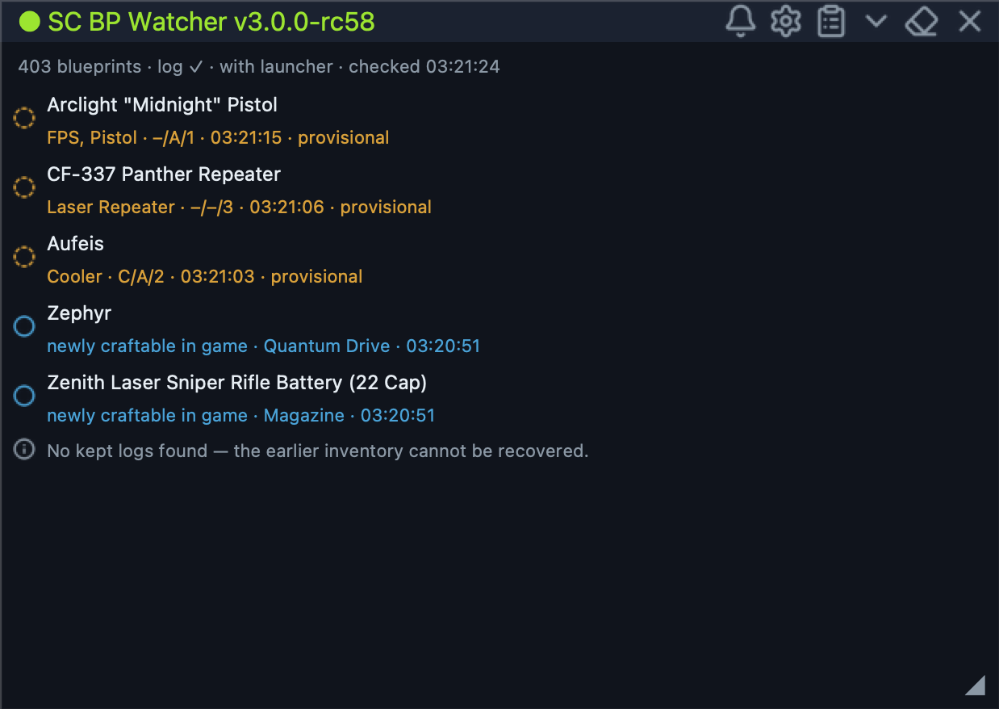<br>
<sub>The overlay — narrow, always on top, opacity adjustable</sub>
</td>
<td width="68%" valign="top" align="center">
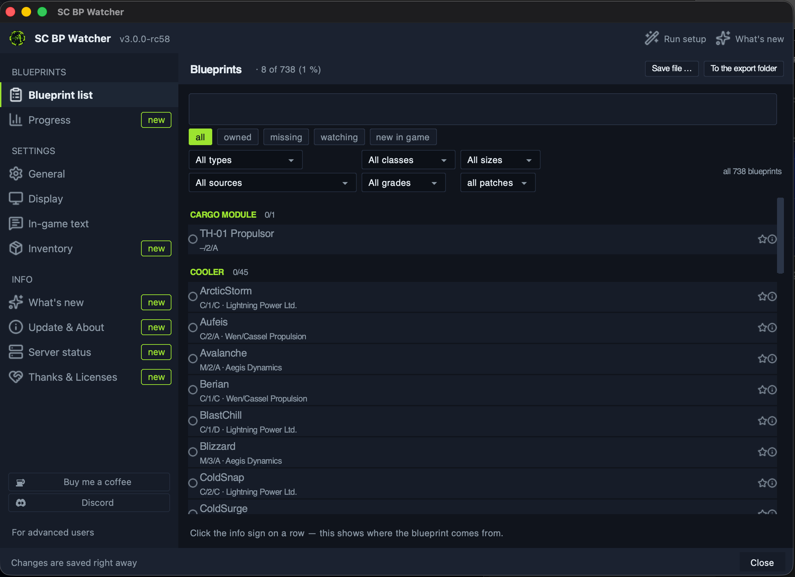<br>
<sub>The blueprint list — search, five filters, and where each blueprint comes from</sub>
</td>
</tr>
</table>

### In game, without tabbing out

The watcher writes into the game's mission text **which** blueprints a contract hands out — with `[x]` for the ones you already have. The count is in the title, the names are in the description.

<table>
<tr>
<td width="50%" valign="top" align="center">
<br>
<sub><b>3 of 6</b> — <code>[x]</code> you have, <code>[&nbsp;&nbsp;]</code> still missing</sub>
</td>
<td width="50%" valign="top" align="center">
<br>
<sub><b>0 of 12</b> — nothing here that you already own</sub>
</td>
</tr>
</table>

### The window

> [!NOTE]
> The screenshots below show **v3.0.0** (currently a test build, `v3.0.0-rc`, under [Releases](../../releases)). In v2.0.0 the window still looks different — if you are looking for something shown here and cannot find it, that is the older version, not a bug.

<table>
<tr>
<td width="50%" valign="top" align="center">
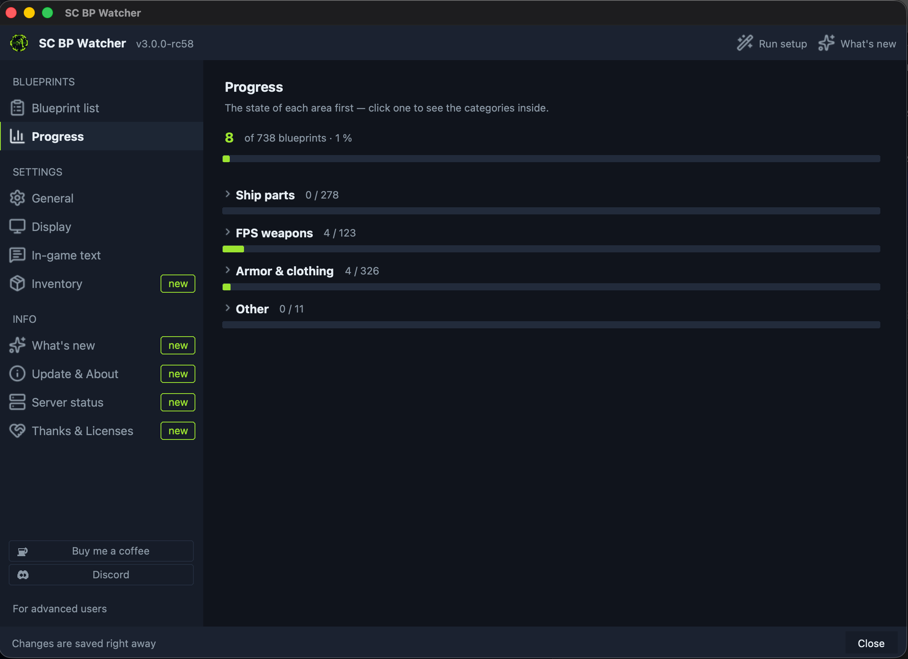<br>
<sub><b>Progress</b> — per area, details on click</sub>
</td>
<td width="50%" valign="top" align="center">
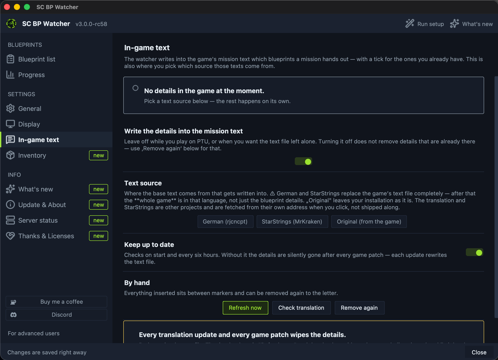<br>
<sub><b>In-game text</b> — pick a text source, switch it on and off</sub>
</td>
</tr>
<tr>
<td valign="top" align="center">
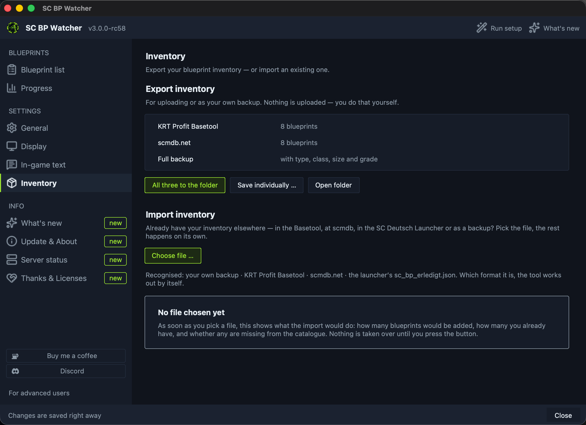<br>
<sub><b>Inventory</b> — export for the basetool, or import an existing one</sub>
</td>
<td valign="top" align="center">
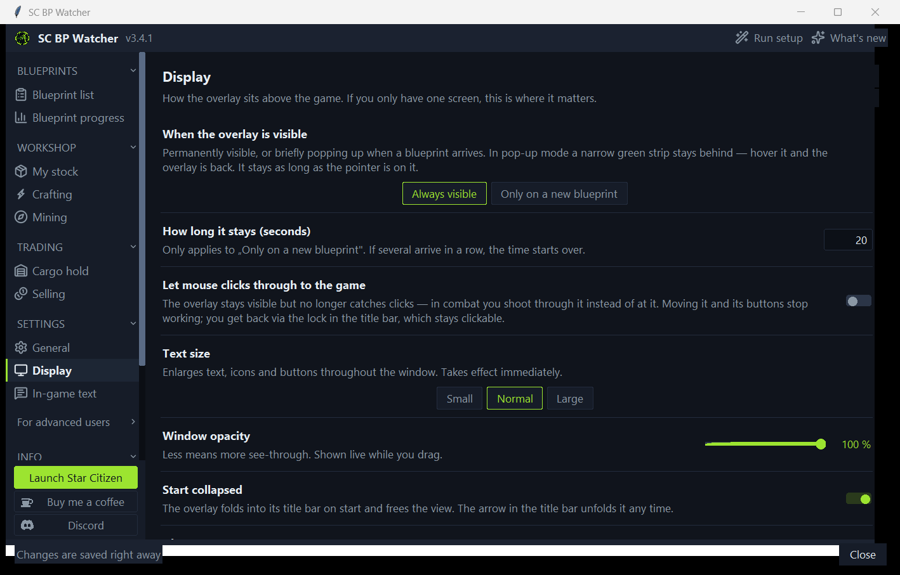<br>
<sub><b>Display</b> — pop-up mode, click-through, font size</sub>
</td>
</tr>
<tr>
<td valign="top" align="center">
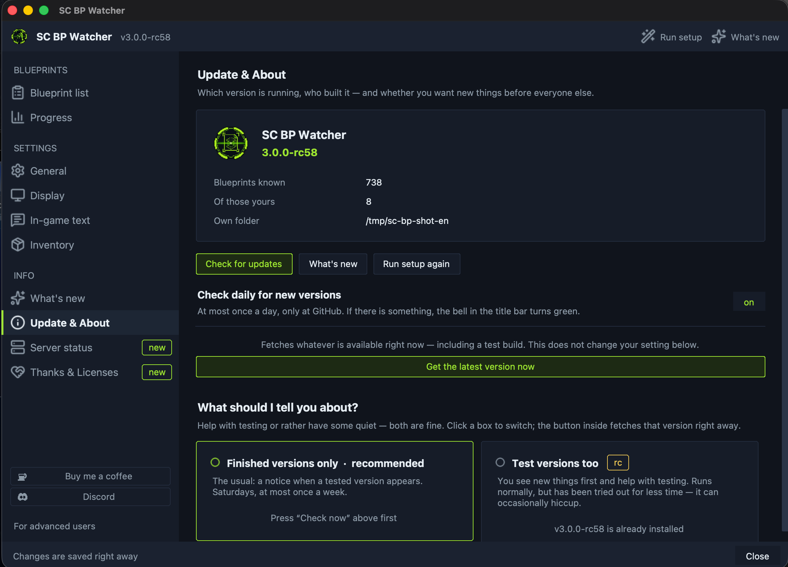<br>
<sub><b>About</b> — stable releases or test builds, with a button to fetch one</sub>
</td>
<td valign="top" align="center">
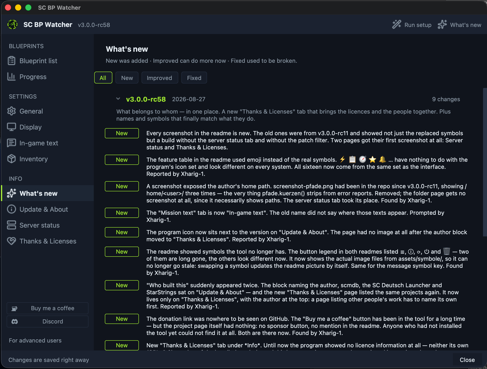<br>
<sub><b>What's new</b> — every release expandable, filtered by kind</sub>
</td>
</tr>
</tr>
<tr>
<td valign="top" align="center">
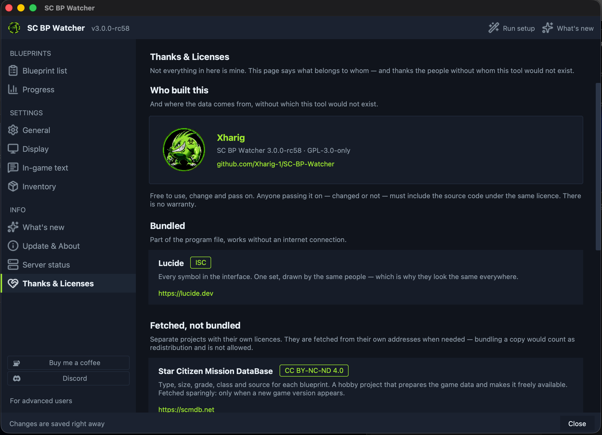<br>
<sub><b>Thanks &amp; Licenses</b> — what belongs to whom, and who helped</sub>
</td>
<td valign="top" align="center">
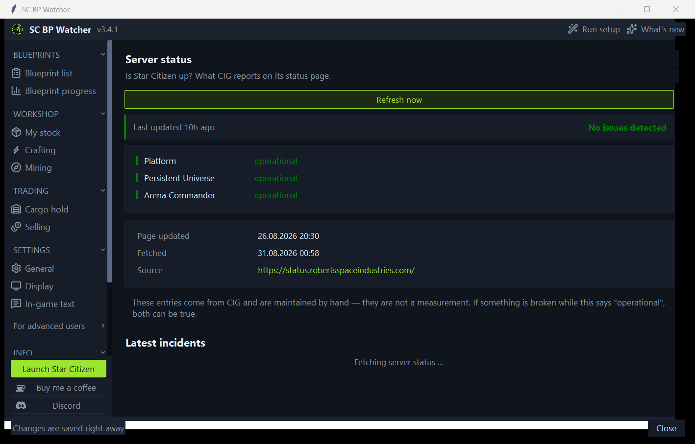<br>
<sub><b>Server status</b> — is Star Citizen up?</sub>
</td>
</table>

<details>
<summary>And the rest: General</summary>

<table>
<tr>
<td width="50%" valign="top" align="center">
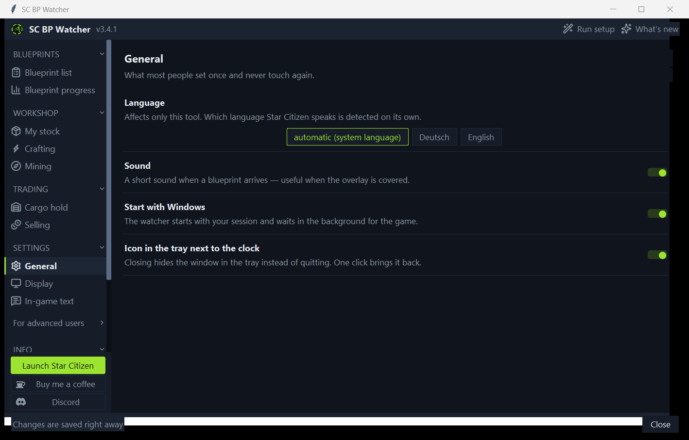<br>
<sub><b>General</b> — language, sound, autostart, menu entry</sub>
</td>
<td width="50%" valign="top" align="center">
</td>
</tr>
</table>

</details>

## Why this tool

There are several blueprint lists. Four things make the difference day to day:

- **You never leave the game.** The overlay sits on top of Star Citizen. No second window, no alt-tab, no browser — the new blueprint is simply there while you keep playing.
- **It knows what you already have.** The watcher keeps your blueprint inventory itself and reads Star Citizen's stored session logs on first start — you get your existing collection for free, without typing anything. If a gap remains anyway, it says so instead of passing off an incomplete list as complete.
- **It tells you where to get what's missing.** For **655 of the 722** blueprints it shows which faction offers it, in which contract, from which standing, and what it pays — sorted by the easiest route. "I'm missing X" is half the information; "X drops at Foxwell from Veteran Contractor" is all of it.
- **Nothing leaves your machine.** No account, no sign-in, no cloud. It reads files that are already on your disk and writes nothing back into the game.

On top of that: class, size and grade are right there in the line (`M/1/A`), the interface speaks German and English, and the whole thing runs on the plain Python standard library — no extra packages, no dependencies that break tomorrow.

## Features

| | |
|---|---|
|  **Instant** | Reads Star Citizen's `Game.log` → the blueprint is in the list **within seconds** |
|  **Blueprint list** | Search everything, grouped by type, filters *all / owned / missing / watching / new in game*, with progress. Tick items with one click |
|  **Where it drops** | One click shows faction, contract, required standing and payout — for **655 of 722** blueprints, sorted by the easiest route |
|  **Setup wizard** | Four steps on first start — and **repeatable any time**, no digging through menus |
|  **Catalogue watch** | Also reports when something becomes **newly craftable in the game** — a blueprint CIG added that did not exist before |
|  **Server status** | A tab of its own: **is Star Citizen up?** Shows what CIG reports on its status page — all three systems plus the incidents of the last two months in full. Refreshes itself once a minute. States stay in CIG's own wording; the entries are maintained by hand, not measured |
|  **New in game** | Its own filter in the list: **only what the current patch added**. Every blueprint carries the game version it first appeared in; when the next patch lands, the new ones move in and the old ones drop out of the filter — the stamp stays |
|  **Watchlist** | Click the star next to anything you are waiting for. When it shows up it is announced in gold — and **removed from the watchlist by itself** |
|  **Class · size · grade** | Compact tag `class/size/grade` per blueprint, e.g. `M/1/A` (Military · Size 1 · Grade A) |
|  **Sound** | A short beep on every find — you don't have to watch the window |
|  **Always on top** | Borderless, slightly translucent overlay above the game |
|  **Movable & resizable** | Drag the title bar, resize at the ◢ handle — **position and size are remembered** |
|  **German and English** | Interface switchable; the in-game blueprint message is recognised in both languages |
|  **Tells you about updates** | Notices new versions by itself — with „What's new" to read up on, including older releases |
|  **Read only** | Changes nothing in the game — reads `Game.log` and, if present, the launcher files |
|  **Own inventory** | Keeps track of which blueprints you have — without the SC Deutsch Launcher |
| 🕓 **Catch-up** | Reads stored logs of earlier sessions on start and picks up what was unlocked while it wasn't running |
| 🐧 **Windows and Linux** | One build for both systems, including autostart and log language detection |

## Requirements

- **Windows or Linux**
- **Star Citizen** installed — the folder containing `Game.log` is what's looked for. On Linux the usual Wine prefixes are searched (lug-helper, Lutris, Bottles, Heroic). If nothing is found, the wizard asks.

Nothing else. No Python, no account — and whether you install is your call (see below).

**Optional:** the **[SC Deutsch Launcher](https://www.sc-deutsch-launcher.de/)** (Windows only). With it, finds are additionally confirmed and names come in German.

## Getting started

1. Download the file for your system from the **[releases page](../../releases)**:

   | System | File | What happens |
   |---|---|---|
   | **Windows** | `SC-BP-Watcher-Setup.exe` | Installs with a start menu entry, optional desktop icon and autostart — and uninstalls cleanly |
   | **Linux** | `SC-BP-Watcher-x86_64.AppImage` | A single file. The wizard offers an application menu entry if you want one |

2. Run it. Done.

No Python, no extra packages — the installer brings everything with it and can be removed again through *Apps & Features*.

> **Why the standalone `.exe` is gone** (as of v3.0.0): it existed for a long
> time as a second route, for anyone who did not want to install anything. That
> came at a price you only noticed later — an update put the new version
> **beside** the old file instead of replacing it. Anyone clicking their usual
> shortcut afterwards kept using the old version for months without noticing.
> With the installer that cannot happen: a start-menu entry, updates that
> genuinely replace, autostart as a checkbox, and a clean uninstall. On Linux
> the AppImage stays as it is. On Linux, make the AppImage executable once (right click → Properties → *Executable as program*, or `chmod +x SC-BP-Watcher-x86_64.AppImage`).

On first start a **wizard** walks you through setup: language, finding Star Citizen, collecting your existing blueprints. It takes a minute, and then your inventory is there.

### Code signing

This project has applied to the [SignPath Foundation](https://signpath.org/)
for free code signing for open source projects. Once approved, released
Windows binaries will be signed by SignPath, and Windows will show the
publisher name instead of "unknown publisher".

Builds are produced exclusively by a public GitHub Actions workflow — see
[SECURITY.md](SECURITY.md) for how releases are built and what the program
does and does not send.

### ⚠️ Windows says "Windows protected your PC"

This appears on the first launch, and it is **not a virus detection**:

> Microsoft Defender SmartScreen prevented an unrecognised app from starting.

**To run it anyway:** click **More info** → **Run anyway**. It will not ask again.

**Why this happens:** SmartScreen does not check whether a program is harmful — it checks whether it is **known**. A file becomes known through a purchased code-signing certificate (several hundred euros a year) or by being downloaded by very many people. A free fan tool has neither, and every new version starts from zero again.

**If you would rather not take my word for it — you don't have to:**

- The **source is open** ([here](../../)), and the file is not built by me but by **GitHub Actions** from exactly that source. The build is there to read: [`.github/workflows/release.yml`](.github/workflows/release.yml)
- Every file on the releases page carries its **SHA-256 checksum** — GitHub shows it directly
- Upload it to **[VirusTotal](https://www.virustotal.com)** if you like. Individual scanners are known to flag PyInstaller executables; that is a classic false positive

On **Linux** this message does not exist — the file just needs to be made executable once.

> ℹ️ Verified against a real Star Citizen installation, with both a **German and an English** game client. Feedback from other machines is still welcome — different install locations, different screen setups, Windows. As an [issue](../../issues).

<details>
<summary>Running from source (for the curious and for developers)</summary>

You need [Python 3.8+](https://www.python.org/downloads/) — on Windows tick **„Add Python to PATH"** during setup. No extra packages required.

```bash
git clone https://github.com/Xharig-1/SC-BP-Watcher.git
```

| System | Start with |
|---|---|
| Windows | `SC-BP-Watcher starten.bat` |
| Linux | `SC-BP-Watcher starten.sh` |

On Linux the `tk` package (Python's window library) is often missing. The start script tells you what it is called on your distribution — on Arch `sudo pacman -S tk`, on Debian and Ubuntu `sudo apt install python3-tk`.

The finished files are built by **GitHub** on every version tag ([`.github/workflows/release.yml`](.github/workflows/release.yml)) — nobody has to build by hand, not even the author.

</details>

## Using it

The narrow bar sits above the game and reports new finds. Everything else is behind the symbols in its title bar:

| Symbol | What it does |
|---|---|
|  | **Bell** — a new build is available; turns green as soon as there is one |
|  | **Rocket** — launch Star Citizen. Only appears if a way to start it was found |
|  | **Gear** — open the settings |
|  | **Clipboard** — blueprint list: search, filter, tick off, look up where things drop |
|  | **Chevron** — fold the overlay down to just its bar |
|  | **Eraser** — clear the messages on screen. Your blueprints stay |
|  | **Cross** — close |

| Action | How |
|---|---|
| Move the window | Drag the bar at the top |
| Resize | Drag the **◢** handle at the bottom right |

## How it works

What the coloured dots mean:

| | |
|---|---|
|  | Blueprint unlocked — it's in your inventory |
|  | Read from the game log, waiting for confirmation by the SC Deutsch Launcher (only with it) |
|  | Became newly craftable **in the game** — not something *you* have yet |
|  | Something from your watchlist has appeared |
|  | A note, not an unlock (e.g. a gap in your inventory) |

1. **On start** the tool goes through the stored logs of earlier sessions (`logbackups/`) and quietly adds everything it finds to your inventory — nothing is lost if you played without the watcher running. Those blueprints are **not** reported as new. If the stored logs don't reach far enough back, the watcher says so as an  line instead of passing off an incomplete list as complete.
2. **In the background** the **`Game.log`** is read — every 3 seconds, adjustable. *(The wording of the blueprint message depends on your game language — the watcher works it out by itself, see below.)* When the game writes `Added notification "Blueprint Received: <name>: "` on unlock, the blueprint is in the list **immediately** () and in your inventory.
   - **If the SC Deutsch Launcher is installed as well**, reporting is two-stage: first *provisional* from the log, then  *confirmed* once the launcher catches up and supplies its data. Without the launcher there is no intermediate stage — the log message is the answer.
3. Every new line is inserted at the top (name · type · `M/1/A` · time) and a short sound plays.
   - **Once a minute** the craftable catalogue is checked. If it grew, CIG made something **newly craftable** with a patch → a blue line. This has nothing to do with your own unlocks.
4. **Type, size, grade and class** come from scmdb.net's crafting data and from the bundled game data. If the SC Deutsch Launcher is present, its maintained catalogue takes precedence (German names). Above all of it are your own corrections from `bp-overrides.json`.
5. **Your inventory** grows along and stays in `bestand.json` — with a note where each blueprint came from (log, catch-up, launcher).

> **Why read the log directly?** The SC Deutsch Launcher reads the same file but only exports its own every few minutes. Measured on 2026-07-30: unlock in game **21:23:49** → launcher export **21:26:24** = **2.5 minutes** of delay. Reading it yourself gets you there in seconds — with nobody in between.

Files watched:

```text
…\StarCitizen\LIVE\Game.log                 (the game — the actual source)
…\StarCitizen\LIVE\logbackups\              (earlier sessions, read on start)
…\sc-deutsch-launcher\blueprints\           (optional: confirms, supplies German names)
```

Its own files (inventory, settings, cache) live here:

| System | Folder |
|---|---|
| Windows | `%APPDATA%\sc-bp-watcher\` |
| Linux | `~/.config/sc-bp-watcher/` |

Both can be moved with the `SC_BP_HOME` environment variable.

### Game language

The blueprint message in the log is translated, and the watcher **works out by itself** how it reads in your client. It knows over 700 blueprint names; if a log line contains one of them, the text in front of it is the phrase it was looking for. That works for languages nobody planned for — French and Spanish just as well as English.

German and English are additionally built in, and you can add your own in `phrasen.json` in its own folder:

```json
{ "phrasen": ["Blueprint Received"] }
```

### Setting your own paths

If Star Citizen (or the SC Deutsch Launcher) isn't in one of the usual places, you enter the folder yourself — in `einstellungen.json` in the folder above:

```json
{
  "spiel_ordner": "D:\\Games\\StarCitizen\\LIVE",
  "launcher_ordner": ""
}
```

`spiel_ordner` is the folder containing `Game.log` (usually `LIVE`). An empty field means „search automatically". Restart the watcher after changing it.

> If the watcher can't find the game, it creates this file **by itself** on start and tells you where it is — you don't have to create it by hand. The file lists the places that were searched next to each field, as does the window. So you can see what such a path looks like on your system instead of guessing.

### Waiting for specific items

Waiting for one particular blueprint? Click the **star** next to its name in the blueprint list. The search box finds it in seconds, and the **watching** filter shows what you're waiting for.

When a watched blueprint appears, the watcher announces it in gold with a star and its own sound — and then **removes it from the watchlist by itself**. What you have doesn't need to be on there.

## Settings

In `einstellungen.json` in its own folder — a text file, not code. Restart the watcher after changing it. The file is created on first start and explains every field itself.

| Field | Meaning | Default |
|---|---|---|
| `sprache` | Interface language: `auto`, `de` or `en` | `auto` |
| `spiel_ordner` | Where Star Citizen is (empty = search automatically) | empty |
| `launcher_ordner` | Where the SC Deutsch Launcher is (empty = search automatically) | empty |
| `pruefintervall_sekunden` | How often `Game.log` is checked — 1 to 60 allowed | `3` |
| `signalton` | Short sound on a find | `true` |

**Environment variables** — for a one-off case, without changing anything permanently:

| Variable | Effect |
|---|---|
| `SC_BP_HOME` | different folder for inventory and settings |
| `SC_INSTALL_DIR` | different game folder |
| `SC_BP_LAUNCHER` | different launcher folder |
| `SC_BP_NO_NET=1` | **no** network access — neither crafting data nor update check |
| `SC_BP_SPRACHE` | language for this run (`de` / `en`) |

## Helping to test

New versions appear **on Saturdays**. If you would rather not wait, you can get them earlier:

**Info → Update & About → "Offer test versions too"**

From then on the tool also reports test versions (recognisable by the `rc` in the number)
— through the same update notice as always. Nothing to download by hand, nothing to hunt for.

- **Test versions are fully built and runnable**, but have not been proven for long.
  Something may act up — that is exactly what they are for.
- **The way back is always open.** Switch it off again and you will be offered the next
  finished version: a finished version always counts as newer than any test version of
  the same number. So nobody gets stuck on the test channel by accident.
- **Without this setting you never see a test version.** If you want peace and quiet,
  do nothing — that is the default.

Found something? An [issue](../../issues) helps more than any guess — or the **Report a bug**
forum on [Discord](https://discord.gg/g2E7e6XxZC), if a screenshot is quicker than a description. Under
**For advanced users → Diagnostics** there is "Copy details" — that block holds everything
needed to track a problem down, without any personal information.

## Passing it on

> 🔒 **It's yours.** No account, no sign-in, no cloud. The tool reads files that are on your disk anyway and changes nothing about the game installation. It only reaches out to the network for two things: the value and origin data from scmdb.net (once per game version) and the question of whether there is a new build. Both can be switched off with `SC_BP_NO_NET=1`.

Just pass on the file from the [releases page](../../releases) — the recipient needs neither Python nor a launcher, only Star Citizen.

> ℹ️ Windows SmartScreen reports „unknown publisher" for unsigned files → **More info → Run anyway**.

## Thanks & credits

This tool grew up with the **[SC Deutsch Launcher](https://www.sc-deutsch-launcher.de/)**: it was the only data source in the beginning, and without it this project would not exist. If it is installed, it is still used — it confirms finds and supplies German names. **Many thanks** to the team behind it! 🙏

The values for type, size, grade and class as well as the origin of each blueprint come from the **[Star Citizen Mission DataBase (scmdb.net)](https://scmdb.net)** — a hobby project that prepares the game data and makes it freely available. **Thank you** for that! 🙏

> The watcher **does not ship this data**; it fetches it on your machine directly from scmdb.net, the way a browser would. scmdb is licensed under [CC BY-NC-ND 4.0](https://creativecommons.org/licenses/by-nc-nd/4.0/); a bundled copy would be redistribution and would conflict with that licence as well as with this project's GPL. Fetching is sparing: only when a **new game version** is out.

And thanks to **Haldjas** from **pr0**: he pointed out that an overlay permanently in the way, catching mouse clicks, hurts more than it helps in combat. Two things came out of his suggestion that would not exist otherwise — the overlay can now **pop up only when a blueprint arrives**, and mouse clicks can be **passed through to the game**. Both live under *Display*. Good call, well spotted. 🙏

The interface symbols come from the **[Lucide](https://lucide.dev)** set (ISC licence) — all drawn on the same grid with the same stroke width, which is why they look identical on Windows, Linux and macOS. **Thanks** to the Lucide community! 🙏 The licence text ships with the tool (`assets/symbole/LIZENZ.txt`) and is shown under **Thanks & Licenses**.

SC BP Watcher is an independent, unofficial companion tool with **no** official connection to the SC Deutsch Launcher or Cloud Imperium Games. All brand and project names belong to their respective owners.

## Author

[](https://github.com/der Autor)
**Xharig** — [github.com/der Autor](https://github.com/der Autor)

If you fork this project, please keep the credit in the footer or mention the original source.

## What's next

Work continues — what exactly is not on a list. What a build brought you can read in [`CHANGELOG.md`](CHANGELOG.md) or right in the tool under **„What's new"**.

Wishes and bug reports are welcome as an [issue](../../issues) or on [Discord](https://discord.gg/g2E7e6XxZC) — suggestions make it into the next build more reliably than mind reading.

## Star Citizen Fan Content

> This is an unofficial Star Citizen fan site, not affiliated with the Cloud Imperium group of
> companies. All content on this site not authored by its host or users are property of their
> respective owners.

## License

[GNU GPL v3.0](LICENSE) — free to use and modify; if you distribute it, the source has to come along under the same licence.
